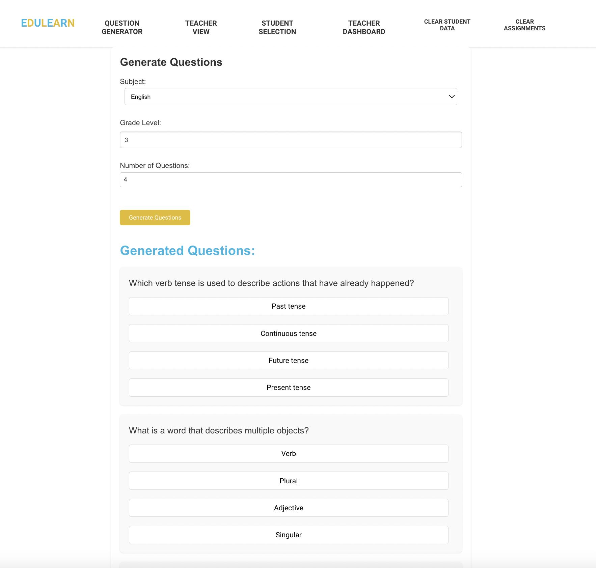
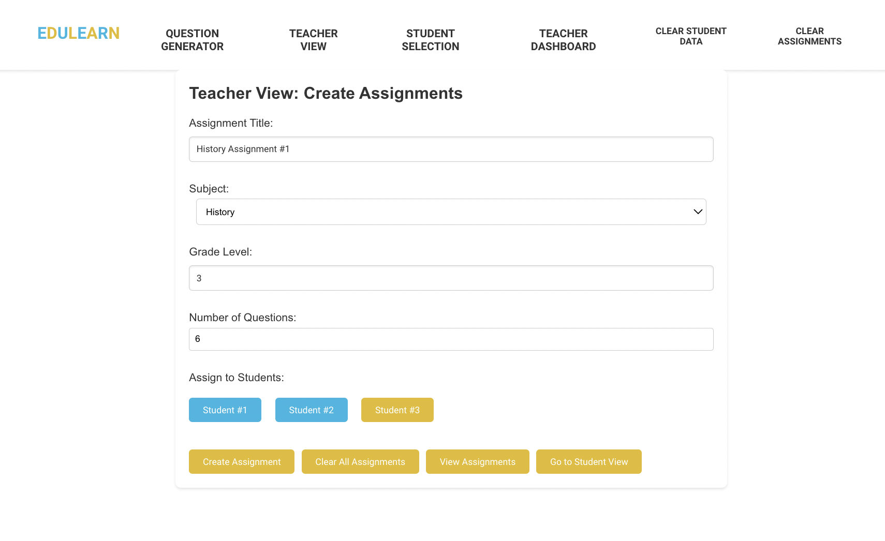
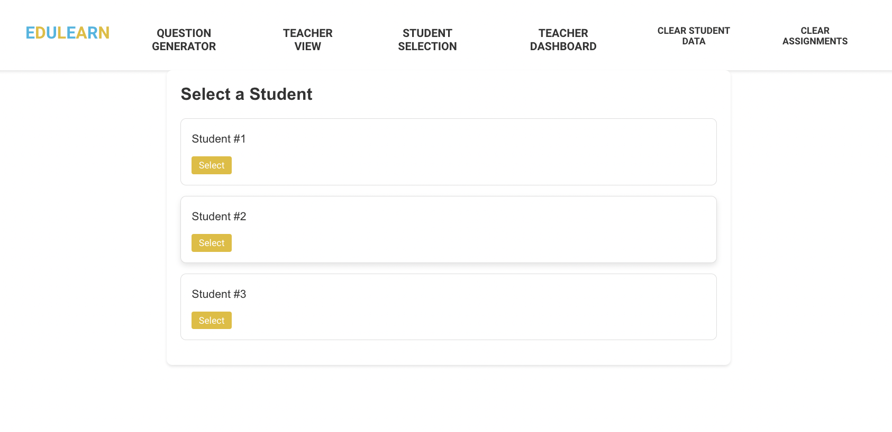
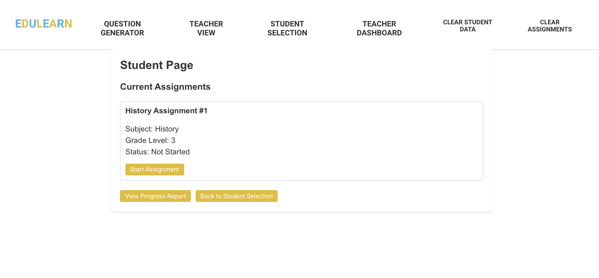
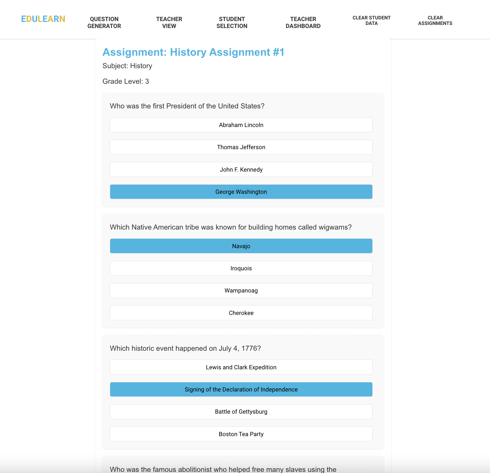
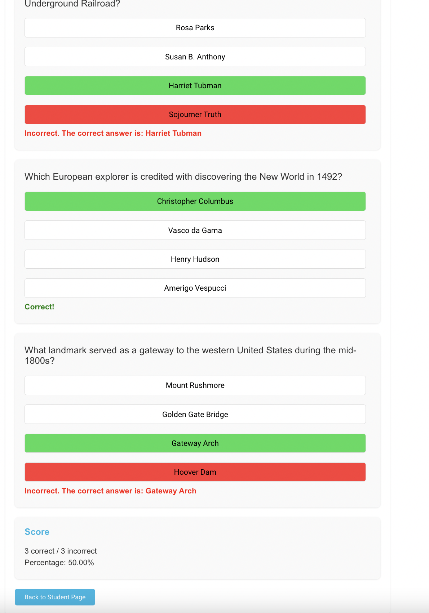
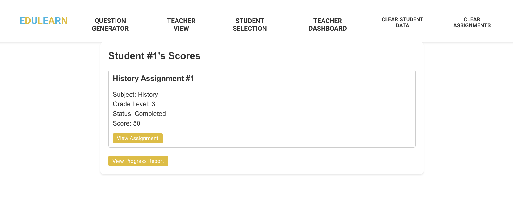
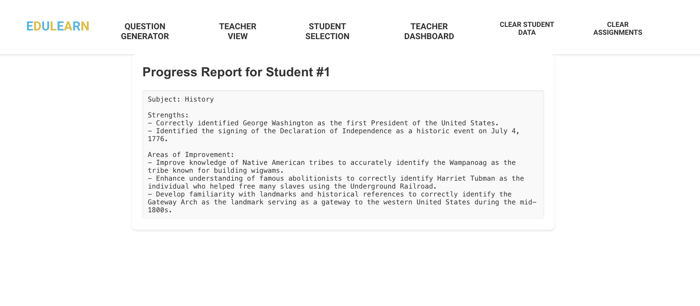

# EduLearn

EduLearn is an AI educational learning site that generate questions and answer choices based on the subject and grade level as well as create personalized progress reports for each student based on their assignment performance. The site provides various features for students and teachers to manage and track assignments and progress.

## Features

### 1. Question Generator
- **Description**: Allows users to generate questions based on the selected subject and grade level.
- **Inputs**:
  - Subject: Math, English, Science, History
  - Grade Level: Text input
  - Number of Questions: Numeric input
- **Outputs**: Generated questions with multiple-choice options.
- **Actions**:
  - **Generate Questions**: Generates a set of questions based on the inputs.
  - **Answer Questions**: Users can select answers for each question.
  - **Submit Answers**: Submits the answers and provides feedback on correctness.
  - **View Feedback**: Displays correct and incorrect answers along with explanations.

### 2. Teacher View
- **Description**: Provides an interface for teachers to create assignments, assign them to students, and manage existing assignments.
- **Inputs**:
  - Assignment Title
  - Subject: Math, English, Science, History
  - Grade Level: Text input
  - Number of Questions: Numeric input
- **Actions**:
  - **Create Assignment**: Creates a new assignment with the specified details.
  - **Assign to Students**: Assigns the created assignment to selected students.
  - **View Assignments**: Lists all created assignments with options to view, edit, or delete them.
  - **Delete Assignment**: Deletes an existing assignment.
  - **Clear All Assignments**: Clears all assignments from the system.

### 3. Student View
- **Description**: Allows students to view and complete assignments, and track their progress.
- **Actions**:
  - **View Assignments**: Lists all assignments assigned to the student.
  - **Complete Assignment**: Allows students to answer questions and submit their responses.
  - **View Feedback**: Provides feedback on submitted assignments, highlighting correct and incorrect answers.
  - **Track Progress**: Displays a summary of the student's performance across different assignments.

### 4. Student Progress Report
- **Description**: Displays a detailed progress report for each student, showing their performance across various subjects.
- **Outputs**: Progress report with performance details such as correct and incorrect answers, overall score, and improvement suggestions.
- **Actions**:
  - **View Report**: Displays the detailed progress report.
  - **Download Report**: Option to download the report as a PDF.

### 5. Admin Features
- **Description**: Provides administrative functionalities for managing users and system settings.
- **Actions**:
  - **Manage Users**: Add, edit, or delete user accounts.
  - **System Settings**: Configure system-wide settings such as database connections and API keys.

## Screenshots

### Question Generator


### Creating Assignments


### Student View Selection


### Student Overview


### Student Assignment Start


### Student Assignment Feedback


### Student Scores


### Student Progress Report


## Installation

### Prerequisites
- Node.js and npm installed
- Python and Flask installed

### Backend Setup
1. Clone the repository:
    ```bash
    git clone https://github.com/yourusername/edulearn.git
    cd edulearn/backend
    ```

2. Create a virtual environment and activate it:
    ```bash
    python -m venv venv
    source venv/bin/activate # On Windows, use `venv\Scripts\activate`
    ```

3. Install the dependencies:
    ```bash
    pip install -r requirements.txt
    ```

4. Set up the PostgreSQL database and update the configuration in `config.py`.

5. Run the Flask server:
    ```bash
    flask run
    ```

### Frontend Setup
1. Navigate to the frontend directory:
    ```bash
    cd edulearn/frontend
    ```

2. Install the dependencies:
    ```bash
    npm install
    ```

3. Run the React development server:
    ```bash
    npm start
    ```

## Usage

### Running the Application
- Start both the frontend and backend servers as described in the installation steps.
- Access the application by navigating to `http://localhost:3000` in your web browser.

### Features Overview
- **Question Generator**: Navigate to the "Question Generator" tab, select the subject, grade level, and number of questions, and click "Generate Questions". Answer the generated questions and submit to get feedback.
- **Teacher View**: Navigate to the "Teacher View" tab to create and manage assignments. You can assign assignments to students and view all existing assignments.
- **Student View**: Navigate to the "Student View" tab to view and complete assignments. Students can track their progress and view feedback on submitted assignments.
- **Progress Report**: Navigate to the "Progress Report" tab to view detailed progress reports for students. The report includes performance details and improvement suggestions.
- **Testing Features**: Testers can manage users and system settings through the interface.
